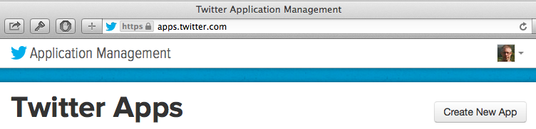
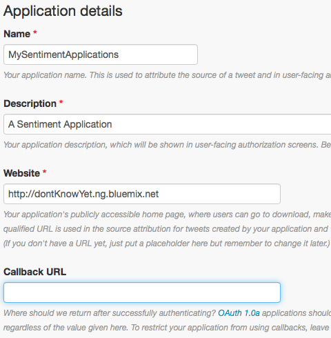
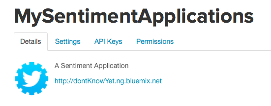

## Simple Sentiment Analysis application

Our sample project analyzes Twitter users' collective sentiment about a search phrase.

Sample application demonstrating how to build a sentiment analysis app usind Node.js and a couple modules.  
The application takes a keyword or hashtag, connects to Twitter to get a stream of matching tweets, 
and runs those tweets through a sentiment-analysis module to produce a sentiment score.

You can play with an instance of the application running at http://simplesentimentanalysisforpulse.ng.bluemix.net/

You can explore the code by clicking into the SimpleSentimentAnalysis folder.

### Running the application on your desktop

If you're viewing this from inside the JazzHub editor then you can select the top folder and choose File->Export->Zip
in the navigator.  After the download unzip the application in a working directory.

If you're familiar with Git and have the command line tools installed you can do the following:

	git clone https://hub.jazz.net/git/spirit/Sentiment.Analysis.App and cd into the directory.

After you have switched to the directory with the Sentiment Analysis code:

Use npm to get the required modules:

    npm install

Run the application with node:

    node app.js

You should see a confirmation that the application is running on port 3000, 
and you can access it with your browser at http://localhost:3000.

### Running the application using a Cloud Foundry PaaS runtime

If you have access to a Cloud Foundry-based runtime, like the Pivotal Cloud Foundry offering or IBM's BlueMix,
you can also run the application in those environments.

If you're in the JazzHub editor, select the Sentiment Analysis App folder and choose "Deploy".  That should begin the process of manually
deploying the Sentiment app to BlueMix.  If you are prompted for BlueMix credentials, enter the IBM ID email and password you
used to obtain a BlueMix account.  If you haven't done that yet, head to [BlueMix](https://ace.ng.bluemix.net)
and register before deploying.

After the deploy is complete, you should see a Manual Deployments section on your Project page in the editor indicating the
status and the URL to get to your version of the running application.

### To get your own Twitter Application Keys

To get your own Twitter application keys for this project or any others first go to the [Twitter Developer Page](https://apps.twitter.com/app) and click on __Create New App__

Then fill in the details for the app as follows.  Since you might not know your URL yet you can put in a placeholder.  Then Scroll down to _Yes I Agree_ disclaimer and press the __Create Your Twitter Application__.

In the Application Management page, choose the API Keys _tab_ to generate your own keys.

Originally you will have no application keys, just the API keys.  Press the __Create My Access Token__ button and accept the prompt that appears.  It might take a minute to do this so you might have to refresh the page.  Once complete there are the API keys at the top of the page and the Access Token keys at the bottom.

Use these in the __app.js__ section replacing the default values.

### Licensed under the EPL (see [license.txt](license.txt))
